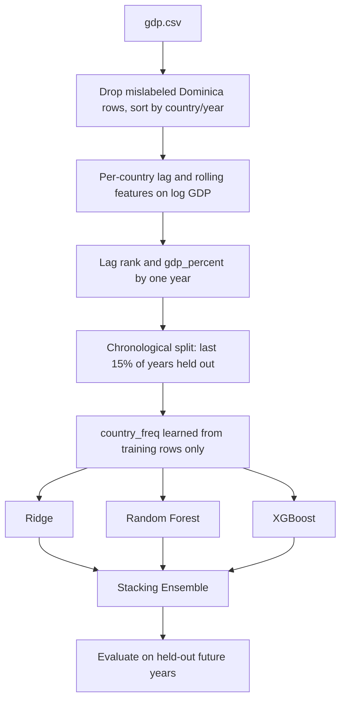

# 🌍 Country GDP Forecasting


A panel-data regression pipeline that forecasts a country's log-transformed GDP from its own lagged history, with every group-level statistic learned strictly from the training period.

## 🧠 Why This Exists

This dataset stacks 209 countries across 61 years, and it hides two leakage patterns that are easy to miss in panel data. First, `rank` and `gdp_percent` are both derived from the same year's GDP across every country simultaneously; using their current-year values to predict current-year GDP is close to circular. Second, `country_freq` — how often a country appears in the dataset — looks harmless, but computing it over the full dataset means the frequency for every country already reflects its presence in the future test years, before the model has been trained on anything.

- **Rank and GDP-share features lagged by one year**, since current-year values are derived from the same year's outcome across all countries
- **`country_freq` learned from the training period only**, after the chronological split boundary is fixed, not from the full 1960-2020 span
- **Mislabeled-country handling documented, not silently dropped**: 'Dominica' collides with two distinct countries in the raw data (GDP values differ ~100x for the same year); rows are removed with the reasoning stated inline
- **Four models compared** on identical, leakage-checked features: Ridge, Random Forest, XGBoost, Stacking Ensemble

## 🚀 Quickstart

```bash
git clone <repo-url>
cd gdp-forecasting
pip install -r requirements.txt
jupyter notebook gdp_forecasting.ipynb
```

Run all cells top to bottom. The notebook reads `data/gdp.csv` relative to its own location.

## 🏗️ Architecture

**Stack**: pandas, NumPy, scikit-learn, XGBoost, matplotlib, seaborn.



The split year is fixed before `country_freq` is computed, so that statistic only ever sees rows a model trained at that point in time would actually have access to.

## 📊 Data & Model Details

**Dataset**: country-level annual GDP records, 209 countries, 1960-2020, 10,134 raw rows. After removing the mislabeled 'Dominica' rows and requiring five years of lag history per country, 8,989 rows remain.

**Features**: 1/2/3-year lags of log GDP, 3-year and 5-year rolling means, one-year-lagged year-over-year growth, one-year-lagged rank and GDP share, years since the country's first appearance, training-only country frequency, and one-hot encoded continent.

**Split**: chronological by year, train through 2014, test 2015-2020 (7,811 train rows, 1,178 test rows).

| Model | RMSE (log scale) | MAE (log scale) | R² |
|---|---|---|---|
| **Stacking Ensemble** | **0.1382** | **0.0877** | **0.9966** |
| Ridge | 0.1391 | 0.0883 | 0.9965 |
| Random Forest | 0.1508 | 0.0951 | 0.9959 |
| XGBoost | 0.1506 | 0.0969 | 0.9959 |

All four models land above R² = 0.995. This is expected, not a red flag: national GDP is highly autocorrelated year over year, and `lag_1` alone carries most of the predictive signal. Re-running with the pre-fix, full-dataset `country_freq` changes the Stacking Ensemble's R² by under 0.001 — the leak was real but the feature it touched was never doing much work.

## 📁 Repository Structure

```
gdp-forecasting/
├── gdp_forecasting.ipynb
├── data/
│   └── GDP.csv
├── requirements.txt
└── README.md
```

## 🤝 Contribution & License

Issues and PRs welcome. Licensed under MIT.
